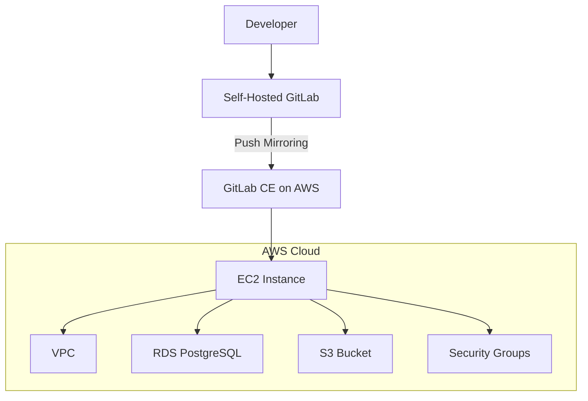
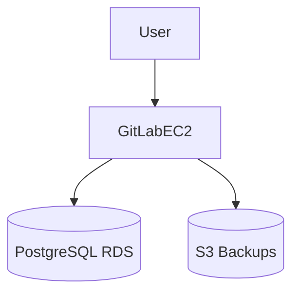

# Cloud-Hosted GitLab with Terraform & Ansible

[](https://www.terraform.io/)
[](https://www.ansible.com/)
[](https://aws.amazon.com/)
[](https://about.gitlab.com/)

---

## Overview

This project demonstrates a complete **infrastructure-as-code and configuration automation workflow** using **Terraform** and **Ansible**.  

- **Terraform** provisions cloud infrastructure on AWS, including EC2 instances, RDS databases, VPCs, and S3 buckets.  
- **Ansible** configures the provisioned instances, installing and setting up **GitLab CE**, and enabling **push mirroring** from a self-hosted GitLab instance.  

This setup showcases skills in:  
- Cloud architecture and resource provisioning  
- Infrastructure as code (Terraform modules, variables, and outputs)  
- Configuration management and automation (Ansible playbooks and roles)  
- DevOps best practices (push mirroring, automated deployments, and security group management)

# Architecture



---

# Technologies Used

| Tool | Purpose |
|---|---|
| Terraform | Infrastructure provisioning |
| Ansible | Configuration management |
| AWS EC2 | GitLab host instance |
| AWS RDS | PostgreSQL database |
| AWS S3 | Backups and artifacts |
| Ubuntu Linux | Server operating system |

# Project Structure

```text
cloud-gitlab/
├── terraform/
│   ├── terraform.tf
│   ├── variables.tf
│   ├── outputs.tf
│   ├── priv.subnet.tf
│   ├── pub.subnet.tf
│   ├── gitlab.tf
│   └── modules/
│
├── ansible/
│   ├── inventory/
│   ├── templates/
│   ├── main.yml/
│   └── ansible.cfg
│
├── scripts/
│   └── deploy.sh
│
└── README.md
```
# Deployment Steps

## 1. Clone the Repository

```bash
git clone https://github.com/yourusername/cloud-gitlab.git
cd cloud-gitlab
```

---

## 2. Provision Infrastructure with Terraform

```bash
cd terraform

terraform init
terraform plan
terraform apply
```

Terraform will provision:

- VPC
- Subnets
- Security groups
- EC2 instance
- RDS database
- S3 bucket

---

## 3. Configure GitLab with Ansible

```bash
cd ../ansible

ansible-playbook playbooks/gitlab.yml
```

Ansible will:

- Install dependencies
- Configure GitLab CE
- Configure services
- Apply security settings
- Prepare push mirroring support




---

# What This Project Demonstrates

This project highlights practical experience with:

- Infrastructure as Code
- Cloud provisioning
- Linux administration
- DevOps automation
- GitLab administration
- AWS networking and security
- End-to-end deployment workflows

---

# License

MIT License

---

# Author

Jackson Davis

LinkedIn: https://linkedin.com/in/yourprofile